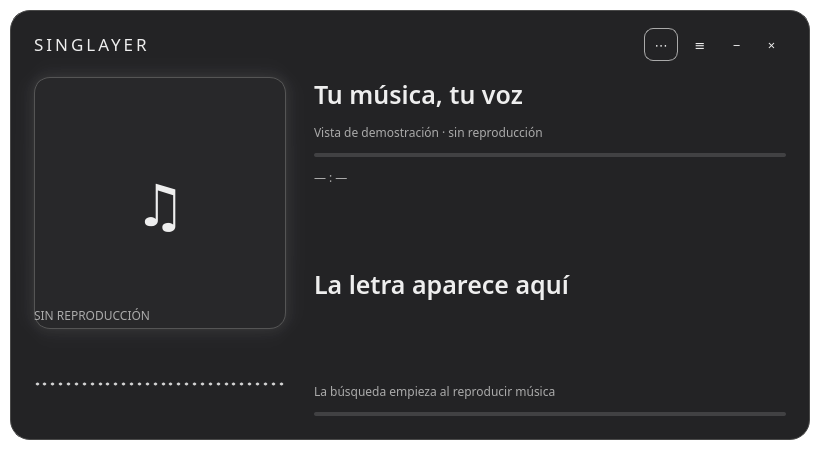

# SingLayer

Un panel nativo para cantar sobre la música de tu navegador, reutilizando
WebNowPlaying, Kotonoha, SongRec/ShazamIO y syncedlyrics.



## Abrir

Si ya tenías SingLayer abierto, cierra la versión anterior (incluido cualquier
`singlayer start` de una terminal). Abre SingLayer desde el menú de aplicaciones.
El lanzador existente apunta al mismo código y no necesita reinstalarse.

Para una instalación nueva consulta las dependencias Qt en el [README](README.md):

```sh
git clone https://github.com/Solar2004/SingLayer.git
cd SingLayer
bash scripts/setup.sh --engines
.venv/bin/singlayer app
```

La instalación incluye ShazamIO, syncedlyrics y NumPy por defecto. En instalaciones
anteriores, el primer inicio prepara los componentes que falten mediante `uv` y
PyPI, sin botón de instalación ni sudo. Necesita Internet. `pactl` y `parec` son
dependencias del sistema. SongRec es opcional; sin él se utiliza ShazamIO.

## Navegador y controles

Instala [WebNowPlaying](https://chromewebstore.google.com/detail/webnowplaying/jfakgfcdgpghbbefmdfjkbdlibjgnbli),
crea un adaptador personalizado con puerto **8975** y actívalo. Desactiva
**Use desktop players** para evitar que nuestro MPRIS vuelva a entrar en la
extensión. Recarga SoundCloud después de instalarla y reproduce una canción.

La aplicación inicia el puente, el overlay y la búsqueda automáticamente. El panel
muestra portada, espectro, canción, letra actual y un único estado de búsqueda.
El menú **⋯** contiene búsqueda manual, alineación, desfase, velocidad y modos de
pronunciación. Cerrar detiene solamente los procesos propios de esta ventana.

**≡** muestra la letra completa con texto más pequeño y desplazamiento automático.
Un doble clic sobre una línea la alinea con la posición actual de la canción.
**⋯ → Elegir otra versión de la letra** consulta alternativas de LRCLIB reutilizando
la búsqueda de Kotonoha; doble clic selecciona una. Las búsquedas automáticas de
SoundCloud prueban también el orden canción-artista si falla artista-canción.
Los errores de captura/proveedor ya no se presentan como ausencia de letras.

Para una versión slowed/sped up con velocidad constante, abre **⋯ → Calibrar
slowed / sped up con dos líneas**. Haz doble clic en una línea cuando empiece a
sonar; marca otra más adelante, al menos 15 segundos después. Se calculan desfase
y velocidad a partir de esas dos referencias y se aplican también al overlay y
la guía fonética. **Restablecer sincronización** vuelve a los tiempos originales.
No modifica la música. Los cortes, reordenaciones o cambios de velocidad internos
de un remix necesitan nuevas referencias: dos puntos no resuelven esos casos.

La pronunciación se calcula localmente, conserva líneas vacías y deduplica
estribillos. **Reintentar pronunciación** está en ⋯. Es una guía aproximada;
los idiomas sin soporte conservan el original.

La búsqueda genera hasta cuatro variantes deduplicadas: metadatos, Unicode
decorativo normalizado, orden invertido y título sin uploader. La limpieza no
elimina palabras arbitrarias que podrían formar parte del título. Los proveedores
de Kotonoha mantienen su comparación aproximada de candidatos.

Para SoundCloud/remixes, una letra encontrada por título no cancela la comprobación
de audio. Se contrastan hasta tres fragmentos sucesivos de 12 segundos, sin mover
la reproducción. Dos identificaciones con el mismo ID de Shazam corroboran la
identidad; sin ID se exige gran similitud de título y artista. La interfaz informa
cuántas muestras coinciden, no un porcentaje de exactitud. Si no hay corroboración,
la letra por metadatos queda como candidata, no como resultado verificado.
Esto no garantiza timing de remixes ni acceso a partes de la canción todavía no
reproducidas. Un fallo de captura detiene esa vía; no provoca capturas del escritorio.

La portada llega desde la extensión. Si hay URL pero falla el transporte binario,
se admite descarga HTTPS desde cuatro CDN de música explícitamente permitidas,
sin redirecciones y con límites de tamaño. No se descargan URLs arbitrarias.
Si falta también la URL se muestra un marcador neutro, no una portada inventada.
Los iconos vienen del tema del sistema. WebNowPlaying no diferencia de forma
fiable Brave/Chrome/Vivaldi: el selector permite indicar la marca manualmente.
El botón de extensión se oculta cuando hay conexión. Sin conexión se ofrece
instalar/configurar, **no se afirma que la extensión esté desinstalada**.

## Búsqueda paralela

LRCLIB, NetEase y KuGou se consultan mediante el código existente de Kotonoha.
Si no encuentran letras, syncedlyrics aporta Musixmatch y Megalobiz. Genius queda
como alternativa de texto sin tiempos, visible en el panel, no como karaoke falso.

Durante la reproducción, el reconocimiento puede solaparse automáticamente con
la búsqueda. Hay un máximo de cuatro operaciones simultáneas y tres fragmentos
de 12 segundos por búsqueda; los fragmentos se capturan en secuencia. Al obtener
letras se cancela el trabajo sobrante. Pausar audio durante ese flujo, cambiar
de pista, detener o cerrar cancela la búsqueda y sus procesos. Las consultas de
la misma identidad se comparten; se conservan hasta 32 resultados en memoria
durante la sesión. Cada operación tiene tiempo límite y hay un límite global.

La barra muestra actividad real, no porcentajes de exactitud inventados.
«Letra encontrada» **no prueba**
que sea la versión correcta o esté sincronizada con un remix.

## Audio y privacidad

La captura selecciona un flujo de reproducción del navegador mediante
`parec --monitor-stream`, nunca el micrófono ni la mezcla completa del escritorio.
Si hay varios flujos ambiguos, no graba. Un navegador puede mezclar varias pestañas
en un mismo flujo: esta solución no garantiza aislamiento por pestaña; evita
llamadas u otro audio privado en ese navegador durante el reconocimiento.
Shazam recibe huellas de audio; los proveedores
de letras reciben canción y artista. Los fragmentos no se conservan: con SongRec
el WAV temporal se elimina al acabar; con ShazamIO se entrega en memoria.
Las barras son un espectro FFT real, no una animación aleatoria.

## Pronunciación local

En **⋯**, selecciona **Pronunciación española · local** o **Original +
pronunciación · local**. Usa diccionarios eSpeak NG para inglés, francés, alemán,
italiano, portugués y ruso; pykakasi para japonés. El español se conserva.
No envía letras ni audio a un servicio de pronunciación. La lectura es aproximada;
la detección de idioma y las lecturas de kanji pueden equivocarse.

La vista dual coloca original y guía en campos separados. Conserva tiempos por
línea; no inventa tiempos por palabra. La transcripción continua conserva su
texto original mientras está siendo estimada.

## Transcripción y versiones editadas

Instala el motor CrisperWhisper 2.0 con `bash scripts/setup-crisper.sh`. El backend actual es CPU int8; la vía rápida CUDA no está disponible para la RX590. El panel inicia el servidor
persistente cuando hace falta transcribir o contrastar una versión editada.

Captura ventanas de 12 segundos del flujo del navegador, cada 8 segundos, y
mantiene una sola ventana pendiente. Descarta audio al pausar, saltar o cambiar de
pista. Un resultado con tiempos inválidos se descarta y se espera otro fragmento.
La captura inicial añade retraso: CrisperWhisper no conoce palabras futuras.

La alineación automática compara frases inequívocas con el catálogo y ajusta
solo esos fragmentos, incluso si aparecen en otro orden. Rechaza frases cortas y
estribillos repetidos ambiguos. Las voces alteradas, mezcladas o tapadas por música
pueden requerir el ajuste manual. Véase `docs/CRISPERWHISPER.md` y `HANDOFF.md`.

## Compatibilidad y límites comprobados

El panel aplica glow local y título personalizado. Reutiliza el blur nativo de
Kotonoha en Wayland cuando el compositor lo admite; en X11 y sin esa capacidad
queda el fondo oscuro translúcido. El blur nuevo no se ha validado en vivo.

El panel usa un perfil de overlay separado (`singlayer/managed`) y el protocolo
de Kotonoha en **28746**, con entrada `adapter` exclusivamente: no elige otro
MPRIS a espaldas del panel. El antiguo comando `singlayer start` permanece como
modo heredado y no incluye este flujo de búsqueda.

Se probaron localmente la interfaz, el coordinador paralelo, los límites de
procesos, la FFT y la recepción real del protocolo por Kotonoha. La instalación
de ShazamIO/syncedlyrics y la prueba en vivo siguen pendientes: esta sesión de
desarrollo no puede resolver PyPI ni acceder al audio/D-Bus del escritorio.
No se promete encontrar todas las canciones ni sincronizar automáticamente
remixes, recortes o cambios de velocidad. La cola/siguiente canción sigue pendiente.

Créditos y licencias: [THIRD_PARTY.md](THIRD_PARTY.md).
